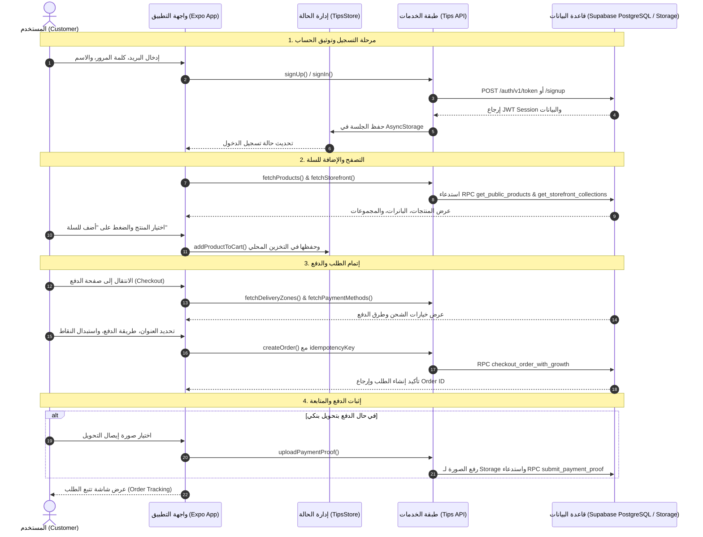

# 📋 TIPS Beauty Project — الشامل للتحليل الفني والمعماري (Comprehensive Technical & Architectural Analysis)

---

## 📑 جدول المحتويات (Table of Contents)

1. [نظرة عامة على المشروع (Project Overview)](#1-نظرة-عامة-على-المشروع)
2. [نظام تسجيل الدخول وإنشاء الحساب (Login / Signup System)](#2-نظام-تسجيل-الدخول-وإنشاء-الحساب)
3. [مصدر البيانات: المنتجات وقواعد البيانات (Products Data Source &amp; Database)](#3-مصدر-البيانات-المنتجات-وقواعد-البيانات)
4. [الصور والتصميم وحالة الـ CSS (Images, Styling &amp; CSS State)](#4-الصور-والتصميم-وحالة-الـ-css)
5. [سلوك التطبيق والميزات الأساسية (App Behavior: Explore, Search, Filter &amp; Buy)](#5-سلوك-التطبيق-والميزات-الأساسية)
6. [طرق الدفع والتحقق المالي (Payment Methods &amp; Verification)](#6-طرق-الدفع-والتحقق-المالي)
7. [التحقق، الأمان، والربط بالـ Backend (Validation, Security &amp; Backend Connection)](#7-التحقق-الأمان-والربط-بالـ-backend)
8. [المعمارية ومخطط سير العمل الكامل (System Architecture &amp; Full Workflow)](#8-المعمارية-ومخطط-سير-العمل-الكامل)
9. [الفجوات والتوصيات لتطوير المشروع (Gaps, Needs &amp; Recommendations)](#9-الفجوات-والتوصيات-لتطوير-المشروع)

---

## 1. نظرة عامة على المشروع

**TIPS Beauty** هو تطبيق تسوق إلكتروني متكامل لمستحضرات التجميل والعناية بالبشرة
مبني باستخدام **React Native (Expo SDK 52)** للواجهات متعددة المنصات (iOS,
Android, Web)، ومدعوم بقاعدة بيانات **Supabase (PostgreSQL)** مع واجهات برمجة
RPC متقدمة وميزات نمو (Growth Marketing) تشمل:

- نظام ولاء ونقاط الجمال (**Beauty Points & Loyalty Tiers: Bronze, Silver,
  Gold**)
- برنامج التسويق بالعمولة (**Affiliate System**)
- نظام الإحالات والمكافآت (**Referral System**)
- تتبع الشحنات وإدارة المرتجعات (**Order Tracking & Returns**)
- تقييمات موثقة بمشتريات حقيقية مع رفع الصور (**Verified Customer Reviews**)

---

## 2. نظام تسجيل الدخول وإنشاء الحساب (Login / Signup)

### هل يوجد نظام تسجيل دخول وإنشاء حساب؟

**نعم، موجود ومكتمل برمجياً في المسار `app/auth.tsx`**.

### كيف يعمل النظام؟

1. **تسجيل الدخول (Sign In):**
   - يتم عبر البريد الإلكتروني وكلمة المرور من خلال دالة `signIn(email, password)`
     في `lib/tips-api.ts`.
   - يستدعي مسار Supabase Auth: `POST /auth/v1/token?grant_type=password`.
2. **إنشاء حساب جديد (Sign Up):**
   - يتم عبر دالة `signUp(email, password, fullName)`.
   - يستدعي `POST /auth/v1/signup` مع إرفاق الاسم الكامل في
     `user_metadata: { full_name: fullName }`.
3. **إدارة الجلسات وحفظ الـ Token (Session Persistence):**
   - يتم تخزين الـ JWT Session محلياً عبر
     `@react-native-async-storage/async-storage` بمفتاح `tips_mobile_session`.
   - عند فتح التطبيق، تقوم دالة `restoreSession()` في `TipsStoreProvider`
     باستعادة الجلسة تلقائياً وتحديث المفضلة وسلة التسوق.
4. **تجربة الضيف (Guest Browsing):**
   - يمكن للمستخدم تصفح المنتجات، البحث، والفلترة بدون تسجيل الدخول.
   - يُطلب تسجيل الدخول عند الرغبة في إتمام الطلب، إضافة منتجات للمفضلة، كتابة
     التقييمات، أو استخدام برنامج النقاط.

---

## 3. مصدر البيانات: المنتجات وقواعد البيانات (Data & Database)

### هل المنتجات تأتي من قاعدة بيانات حقيقية أم Mock Data؟

- **التطبيق مهيأ بالكامل للاتصال بقاعدة بيانات Supabase حقيقية (PostgreSQL).**
- **لا توجد مصفوفات Dummy/Mock ثابتة داخل الكود الأساسي للمتجر.**
- في حال عدم إدخال مفاتيح Supabase في ملف `.env` (`EXPO_PUBLIC_SUPABASE_URL` و
  `EXPO_PUBLIC_SUPABASE_ANON_KEY`)، يظهر التطبيق رسالة تنبيه للمستخدم تفيد
  بضرورة ربط الـ Backend:
  > _"أكمِل ربط Supabase لإظهار المنتجات والطلبات الحقيقية."_

### ما هي البيانات التي تأتي من قاعدة البيانات؟

| نوع البيانات                     | المسار / الدالة في الـ Backend                  | الوصف                                                        |
| :------------------------------- | :---------------------------------------------- | :----------------------------------------------------------- |
| **المنتجات (Products)**          | `/rest/v1/rpc/get_public_products`              | الأسماء، الأسعار، الخصومات، التقييم، والصور                  |
| **إحصائيات المبيعات**            | `/rest/v1/rpc/get_public_product_sales_metrics` | عدد المبيعات لكل منتج لتصنيف الأكثر مبيعاً                    |
| **البانرات الإعلانية**           | `/rest/v1/storefront_banners`                   | عروض الصفحة الرئيسية وروابطها الترويجية                      |
| **المجموعات (Collections)**      | `/rest/v1/rpc/get_storefront_collections`       | تصنيفات الواجهة والمنتجات المرتبطة بها                       |
| **مناطق التوصيل (Zones)**        | `/rest/v1/delivery_zones`                       | المدن والمحافظات مع أسعار التوصيل الخاصة بكل منطقة           |
| **طرق الدفع (Payment Methods)**  | `/rest/v1/payment_methods`                      | الدفع عند الاستلام، التحويل البنكي، وغيرها                   |
| **المفضلة (Favorites)**          | `/rest/v1/customer_favorites`                   | المنتجات المفضلة الخاصة بكل مستخدم                           |
| **الطلبات (Orders)**             | `/rest/v1/orders`                               | سجل الطلبات السابقة وحالات الدفع والشحن                      |
| **ملف الولاء (Loyalty Profile)** | `/rest/v1/profiles`                             | نقاط الجمال، مستوى العضوية (Bronze/Silver/Gold)، كود الإحالة |
| **الإشعارات (Notifications)**    | `/rest/v1/customer_notifications`               | تنبيهات العروض وحالة الطلبات وتوفر المنتجات                  |

---

## 4. الصور والتصميم وحالة الـ CSS (Images & Styling)

### أين توجد صور المنتجات وكيف يتم ربطها؟

1. **صور المنتجات:** حقل `image` في كائن المنتج يحمل رابط CDN مباشر للصور (سواء
   من Supabase Storage أو سيرفر وسائط خارجي).
2. **صور التقييمات (Customer Reviews):**
   - يقوم العميل برفع صورة المنتج من هاتفه عبر `uploadReviewImage()`.
   - تُرفع الصورة إلى **Supabase Storage Bucket: `review-images`** في المسار
     `${userId}/${productId}/${timestamp}.jpg`.
3. **صور إيصالات الدفع (Payment Proofs):**
   - تُرفع إيصالات التحويل البنكي عبر `uploadPaymentProof()` إلى **Supabase
     Storage Bucket: `payment-proofs`**.

### حالة الـ Style ونظام الـ CSS:

- **نظام التصميم:** مبني بالكامل على **Tailwind CSS / NativeWind (v4)** مع ملف
  الإعدادات `tailwind.config.js` والملف العام `global.css`.
- **نظام السمات والألوان (`lib/theme-provider.tsx`):**
  - دعم كامل للـ **Dark Mode** و **Light Mode**.
  - دعم مخصص للاتجاه من اليمين لليسار (**RTL - العربية**).
  - لوحة ألوان فاخرة مخصصة لمنتجات التجميل (درجات الوردي والروز جولد والبيج
    الهادئ مع خلفيات زجاجية Glassmorphism وبطاقات عصرية).
  - خطوط وأيقونات متناسقة وسريعة الاستجابة على الشاشات المختلفة.

---

## 5. سلوك التطبيق والميزات الأساسية (App Core Features)

### 1. استكشاف المتجر (Explore & Storefront)

- الصفحة الرئيسية (`app/(tabs)/index.tsx`) تعرض:
  - شريط بحث سريع للوصول الفوري.
  - بانرات دعائية متحركة ومربوطة بأقسام أو منتجات محددة.
  - تصنيفات مميزة ومجموعات مخصصة (العناية بالبشرة، المكياج، العطور، إلخ).
  - عروض حصرية وقسم الأكثر مبيعاً مبني على إحصائيات المبيعات الحقيقية.

### 2. البحث والفلترة والفرز (Search, Filter & Sort)

- **البحث الفوري:** يدعم البحث بالاسم العربي والإنجليزي والتصنيف والعلامة التجارية
  (`lib/catalog-filters.ts`).
- **ورقة الفلترة المتقدمة (`components/catalog-filter-sheet.tsx`):**
  - فلترة حسب التصنيف (Category).
  - فلترة حسب العلامة التجارية (Brand).
  - فلترة حسب نطاق السعر (Min / Max Price).
  - فلترة المنتجات المخفضة فقط أو المتوفرة في المخزون.
- **الفرز (`lib/product-sorting.ts`):**
  - الأحدث وصولاً (Newest).
  - السعر من الأقل للأعلى / من الأعلى للأقل.
  - الأعلى تقييماً (Top Rated).
  - الأكثر مبيعاً (Best Sellers).

### 3. سلة التسوق والشراء (Cart & Purchase)

- **إدارة السلة (`lib/cart-utils.ts` & `lib/tips-store.tsx`):**
  - إضافة وحذف وتعديل الكميات مع الحفظ الفوري في ذاكرة الجهاز `AsyncStorage`.
  - حساب المجموع والخصومات تلقائياً (`getDiscountedPrice`).
  - حساب تكلفة الشحن ديناميكياً بناءً على المدينة المختارة من جدول مناطق التوصيل
    (`delivery_zones`).

---

## 6. طرق الدفع والتحقق المالي (Payment Methods)

### الطرق المتاحة داخل المشروع:

1. **الدفع عند الاستلام (Cash on Delivery - COD):**
   - يتم إنشاء الطلب مباشرة بحالة `pending`.
2. **التحويل البنكي والمحافظ الإلكترونية (Bank Transfer / Wallets):**
   - يتطلب إرفاق صورة إثبات الدفع (`requires_proof: true`).
   - ينقل المستخدم لشاشة `app/payment-proof.tsx` لرفع صورة الإشعار وربطه برقم
     الطلب عبر إجراء `submit_payment_proof`.
3. **برنامج الولاء والخصومات:**
   - إمكانية استبدال نقاط الجمال (`beauty_points`) بخصم نقدي عند إتمام الطلب.
   - إدخال كوبونات الخصم (`coupon_code`).
   - تطبيق أكواد الإحالة والتسويق بالعمولة (`referral_code` & `affiliate_code`).

---

## 7. التحقق، الأمان، والربط بالـ Backend (Validation & Architecture)

### طبقة التحقق من البيانات (Validation):

- **Client-Side:** التحقق من صحة رقم الهاتف، تعبئة بيانات العنوان والمدينة، فحص
  سعة الصور قبل الرفع (أقل من 5MB)، والتحقق من توفر الكميات المطلوبة في السلة.
- **Backend-Side (PostgreSQL Stored Procedures / RPC):**
  - إجراء `checkout_order_with_growth`: يتحقق في عملية ذرية (Atomic Transaction)
    من:
    1. توفر المخزون للمنتجات.
    2. صلاحية كوبون الخصم.
    3. كفاية رصيد نقاط الولاء للعميل وخصمها فوراً.
    4. تطبيق عمولة المسوق إن وُجد.
    5. منع التكرار عبر مفتاح فريد (`idempotency_key`).
  - إجراء `submit_purchased_product_review`: يتحقق من أن العميل اشترى المنتج
    بالفعل قبل نشر التقييم (`verified_purchase`).

### آلية الربط بالـ Backend:

- التطبيق يتصل مباشرة بـ **Supabase REST API & RPC** عبر مكتبة الـ Fetch المخصصة
  في `lib/tips-api.ts`.
- يتم تأمين جميع الطلبات الحساسة باستخدام ترويسة الـ JWT Token:
  `Authorization: Bearer <session.access_token>`
- يوجد أيضاً هيكل خادم جاهز (`server/routers.ts`) مبني بـ **tRPC و Drizzle ORM**
  لمن يرغب في تشغيل خادم وسيط إضافي.

---

## 8. المعمارية ومخطط سير العمل الكامل (End-to-End Workflow)

---

## 9. الفجوات الحالية والتوصيات الإضافية (Gaps & Recommendations)

لرفع كفاءة المشروع إلى أعلى مستوى تجاري واحترافي، نوصي بإضافة التحسينات التالية:

1. **بوابات دفع إلكتروني مباشرة (Online Payment Gateways):**
   - دمج بوابات مثل **Stripe / Tap Payments / Moyasar / HyperPay** لتمكين الدفع
     الفوري بالبطاقات البنكية و Apple Pay بدلاً من الاعتماد الحصري على التحويل
     اليدوي.
2. **إشعارات الدفع اللحظية (Push Notifications):**
   - التطبيق يحتوي على دالة `registerCustomerPushToken`؛ ينبغي ربطها مع **Expo
     Push Notification Service** لإرسال تحديثات حالة الشحنة والعروض الترويجية في
     الوقت الحقيقي.
3. **تخزين مؤقت بدون اتصال (Offline Caching / React Query):**
   - استخدام `@tanstack/react-query` لإدارة التخزين المؤقت للبيانات (Caching)
     وتقليل عدد الاستدعاءات لـ Supabase وتسريع استجابة الواجهة.
4. **لوحة تحكم إدارية (Admin Dashboard):**
   - بناء لوحة تحكم سريعة لإدارة المخزون، قبول أو رفض إثباتات الدفع، وإدارة طلبات
     الإرجاع وكوبونات الخصم.
5. **مساعد الجمال بالذكاء الاصطناعي (AI Beauty Assistant):**
   - يوجد مسار أولي لـ `app/ai-chat.tsx`، يمكن تفعيله لتقديم استشارات مخصصة
     للعناية بالبشرة والمكياج وترشيح المنتجات المناسبة لنوع بشرة العميل لزيادة
     المبيعات (Upselling).

---

_تم إنشاء هذا التحليل بناءً على الفحص الشامل لشيفرة المصدر وملفات المشروع._
